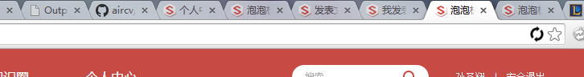

# aircv
[](https://travis-ci.org/NetEaseGame/aircv)
[](https://pypi.python.org/pypi/aircv)

Find object position based on python-opencv2 *for python2.7+*

## Usage

    import aircv as ac
    imsrc = ac.imread('youimage.png') # 原始图像
    imsch = ac.imread('searched.png') # 带查找的部分

#### SIFT查找图像

    print ac.find_sift(imsrc, imsch)
    # - when Not found
    @return None 
    # 之前是返回的 []
    
    # - when found
    @return {'point': (203, 245), 'rectangle': [(160, 24), (161, 66), (270, 66), (269, 24)], 'confidence': 0.09}
    # point: 查找到的点
    # rectangle： 目标图像周围四个点的坐标
    # confidence: 查找图片匹配成功的特征点 除以 总的特征点
    

#### SIFT多个相同的部分查找

    print ac.find_all_sift(imsrc, imsch, maxcnt = 0)
    # - when not found
    @return []
    # - when found
    @return [{..}, {..}]
    # {..}的内容跟SIFT查找到单个图像的格式一样

maxcnt是可选参数，限制最多匹配的数量。

#### 直接匹配查找图像

    print ac.find_template(imsrc, imsch)

期望输出 (目标图片的中心点，相似度)， 相似度是电脑计算出来的一个值，跟平常所说的相似97%不是一个意思。对于这个值，达到0.999以上才算是图片一样。

    (294, 13), 0.9715

查找多个相同的图片，如在图形



中查找


    print ac.find_all_template(imsrc, imsch)

期望输出 (目标图片的中心点，相似度)

    [((294, 13), 0.9715), ...]

效果


## 开发规范
[开发规范](docs/DEVELOPMENT.md)

## LICENSE
LICENCE under [MIT](LICENSE)

## Some other idea. Not implemented

### example
```python
import aircv

imsrc = aircv.Image('demo.png')
imobj = aircv.Image('object.png')

print imsrc.find(imobj, method=aircv.FIND_TMPL) # or method=aircv.FIND_SIFT
# expect aircv.Position(x=10, y=20, extra={'method': aircv.FIND\_TMPL, 'result': 0.98})

print imobj.find_in(imsrc, method=aircv.FIND_TMPL)
# expect aircv.Position(x=10, y=20)

rect = aircv.Rect(left=80, top=10, width=50, height=90)
# Rect define: Rect(left=0, top=0, right=None, bottom=None, width='100%', height='100%')
pos = imsrc.find(imobj, rect=rect, method=aircv.FIND_TMPL)
print pos
# expect aircv.Position(x=10, y=20)

print imsrc.draw_point(pos) # .draw_point(pos2)
# expect aircv.Image object

print imsrc.draw_rectangle(aircv.Rect(left=80))
# expect aircv.Image object

print imsrc.draw_circle(??)

print imsrc.cv_object
# expect numpy object

imsrc.save('source.png')
# An Exception raised when file exists

print imsrc.rect() == imobj.rect()
# expect True or False

print imsrc.percent(imobj)
```
